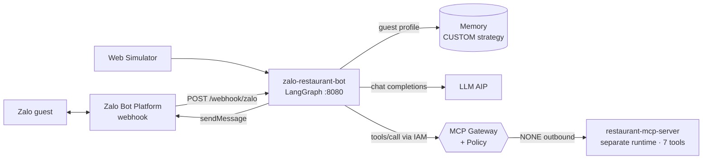

# 🍜 Zalo Restaurant Bot — "Quán Ngon 123" (remembers returning guests)

> An **end-to-end** sample on **GreenNode AgentBase**: Agent Runtime + **custom MCP server running as its own runtime** + **MCP Gateway** (IAM + Policy) + **CUSTOM Memory** (guest profiles) + the **Zalo Bot Platform** (real webhook) + a **Web Simulator**.

📚 [Interactive architecture diagram](docs/architecture.html)

## 🔗 Live demo (public endpoints)

| What | URL |
|---|---|
| **Web Simulator** (open in browser) | https://endpoint-00c922d6-7cc9-437b-95c3-121a7e744308.agentbase-runtime.aiplatform.vngcloud.vn/ |
| Zalo webhook (POST, secret-verified) | https://endpoint-00c922d6-7cc9-437b-95c3-121a7e744308.agentbase-runtime.aiplatform.vngcloud.vn/webhook/zalo |
| MCP server (separate runtime) | https://endpoint-27c8e2c0-a5ca-4d74-9766-5a0506f67cbf.agentbase-runtime.aiplatform.vngcloud.vn/health |
| REST API | https://endpoint-00c922d6-7cc9-437b-95c3-121a7e744308.agentbase-runtime.aiplatform.vngcloud.vn/invocations |

> Endpoints live on the demo account — they may be taken down after the demo period; deploy your own with Steps A–C below. To chat with the real Zalo bot, search the bot in the Zalo app (see Step D).

---

## ✨ The experience — the restaurant *remembers* its guests

| Situation | What the bot does (automatically) |
|---|---|
| "I'm Hung, book a table tonight for 4, **no spicy food**" | 📋 Checks tables through **MCP** (`check_availability`) → suggests a table • 🧠 `remember` "Hung, non-spicy" • confirms + `create_booking` |
| Returns later **via Zalo** (new session): "I'll come back this weekend" | ✨ *"Hi Hung! You sat at table T3 last time — the kitchen always cooks non-spicy for you"* — guest profile from the **CUSTOM memory strategy** |
| Unknown caller hits `/webhook/zalo` without the secret | 🔒 **403 Denied** (`X-Bot-Api-Secret-Token` header) |

The **Web Simulator** (`GET /`): a Zalo-style UI (phone frame), add new guests, chat, plus a **🧠 Guest profile** panel and a **📋 Current bookings** table (read live from the MCP server).

## 🏗 Architecture — 2 runtimes, 1 gateway



- **`src/mcp-server`** — a FastMCP server (stateless HTTP) with 7 restaurant tools: `get_menu`, `check_availability`, `create_booking`, `list_bookings`, `cancel_booking`, `get_loyalty`, `add_loyalty_points` — **deployed as its own AgentBase runtime**, exposed through the gateway via the `restaurant` connector (outbound **NONE**).
- **`src/backend`** — LangGraph agent + Memory (1 **CUSTOM** strategy "customer-profile") + the Zalo webhook (secret verification, retry dedupe, replies with `parse_mode=markdown`).
- **Policy** — `sample-gw-policy`: the zalo-bot may call only the 7 `restaurant__*` actions; travel-buddy (a separate sample repo) only `tavily__*`; everything else is **denied by default**.

## 📁 Layout

```
├── src/mcp-server/       # main.py (FastMCP, 7 tools) · Dockerfile · requirements.txt
├── src/backend/          # main.py · agent.py · memory_tools.py · zalo.py · mcp_client.py
├── src/frontend/         # simulator (index.html · style.css · app.js)
├── docs/architecture.html
├── Dockerfile · .env.example
```

## 🚀 Run locally

```bash
# 1) MCP server (must run first — the agent calls it)
cd src/mcp-server && docker build -t restaurant-mcp . && docker run -p 8081:8080 restaurant-mcp
# 2) Agent
cd ../.. && cp .env.example .env   # MCP_RESTAURANT_URL=http://host.docker.internal:8081/mcp
docker build -t zalo-bot . && docker run -p 8080:8080 --env-file .env zalo-bot
# open http://localhost:8080 (simulator)
```

Without a Zalo token the sample still works 100% through the **simulator**; the UI shows `zalo_configured=false`.

## ☁️ Deploy to GreenNode AgentBase — via the Portal (UI)

Portal: **https://aiplatform.console.vngcloud.vn**. Step 1 (LLM key) and Steps 3–4 (Gateway/Policy) are identical to the [greennode-agentbase-sample-travel-buddy](../greennode-agentbase-sample-travel-buddy) README — only the connector and policy actions differ (`restaurant__*`). The steps unique to this repo:

### Step A — Deploy the MCP server as its own runtime
1. `docker build -t <registry>/zalo-mcp-server:v1 src/mcp-server/ && docker push …`
2. Portal → **Agents → Create Agent (Custom)**: name `zalo-mcp-server`, the image above, flavor `runtime-s2-general-2x4`, **no env vars**.
3. When ACTIVE → copy the **endpoint URL**. Test: `<endpoint>/health` must return `{"status":"ok","tools":7}`.

### Step B — Add the `restaurant` connector (No authorization)
Portal → Gateway `sample-mcp-gw` → **Add Custom Connector**:
- **Name**: `restaurant` · **Type**: `MCP`
- **Endpoint / Connect URL**: `<mcp-server-endpoint-from-step-A>/mcp`
- **Outbound auth**: **No authorization** (internal server, no secret)

API: `PATCH /gateway/api/v1/gateways/sample-mcp-gw {"targets":[…,{"name":"restaurant","type":"MCP","endpoint":"<url>/mcp","outboundAuth":{"type":"NONE"}}]}`.

### Step C — Deploy the agent runtime
1. `docker build -t <registry>/zalo-restaurant-bot:v1 . && docker push …`
2. Portal → **Create Agent (Custom)**: name `zalo-restaurant-bot`, env vars per the table below.
3. Open the endpoint → the **Web Simulator** works immediately.

### Step D — Connect a real Zalo Bot (bot.zaloplatforms.com)
1. Create the bot: **https://bot.zaloplatforms.com** → *Create Bot* (docs: [create-bot](https://bot.zaloplatforms.com/docs/create-bot/)) → you receive a **Bot Token** shaped `<id>:<secret>` (resettable in Zalo Bot Creator).
2. Portal → AgentBase → agent `zalo-restaurant-bot` → **Update Environment**: add `ZALO_BOT_TOKEN` + `ZALO_WEBHOOK_SECRET` (a secret string of 8–256 chars you choose) → the runtime restarts automatically.
3. Register the webhook (one command, docs [setWebhook](https://bot.zaloplatforms.com/docs/apis/setWebhook/)):
   ```bash
   curl -X POST "https://bot-api.zaloplatforms.com/bot${ZALO_BOT_TOKEN}/setWebhook" \
     -H "Content-Type: application/json" \
     -d '{"url":"<runtime-endpoint>/webhook/zalo","secret_token":"<ZALO_WEBHOOK_SECRET>"}'
   # ✓ "verification":{"ok":true,"outcome":"webhook.ok"}
   ```
4. **Message the bot in the Zalo app** (share link from Zalo Bot Creator) → it replies and stores the guest profile. Re-check config: `getWebhookInfo` · test: `testWebhook`.
5. The bot replies with `parse_mode=markdown` (bold/lists render natively on Zalo). Only `event_name = message.text.received` is handled; image/sticker/voice events are safely ignored.

## 🔧 Env reference

| Variable | Required | Meaning |
|---|---|---|
| `LLM_API_KEY` · `LLM_MODEL` | ✅ | LLM AIP |
| `AGENTBASE_MEMORY_ID` | ✅ | `memory-…` (create as in the travel repo Step 2, with **one CUSTOM strategy** named `customer-profile`, prompt: *"Extract the restaurant guest profile: name, phone, food preferences (vegetarian/spicy/allergies), usual table, birthday, visit history."*) |
| `MEMORY_STRATEGY_ID` | ✅ | that strategy's `ltms-…` ID |
| `MCP_RESTAURANT_URL` | ✅ | `<gateway-url>/restaurant` |
| `ZALO_BOT_TOKEN` | optional | enables the real Zalo mode |
| `ZALO_WEBHOOK_SECRET` | recommended | verifies the `X-Bot-Api-Secret-Token` header |
| `ZALO_API_BASE` | default | `https://bot-api.zaloplatforms.com` |

## 🔌 API contract

| Method | Path | Description |
|---|---|---|
| POST | `/invocations` | simulator/REST chat (user/session headers) · `{"op":"whoami"}` |
| POST | `/webhook/zalo` | Zalo Bot Platform webhook (secret verification, `message_id` dedupe) |
| GET | `/webhook/zalo?challenge=` | manual check |
| GET | `/api/memory?actor=` · `/api/history` · `/api/actors` | guest profile · conversation · known guests |
| GET | `/api/bookings` | calls the MCP `list_bookings` tool directly |
| GET | `/api/info` · `/health` | config (includes `zalo_configured`, bot name) |

## ✅ Verified end-to-end (demo account)

- MCP server runtime ACTIVE (`/health` → 7 tools) · the `restaurant` connector works through the gateway.
- Hung (no-spicy) → table T3 · Lan (vegetarian, 6 guests, T7) → booking created; a new session later → the bot recalls the profile exactly.
- Webhook: correct secret → processed + replied (`sent` reflects a real Zalo send); wrong secret → **403**; `setWebhook` returned `verification.ok = true`.
- Policy: an unknown token calling the gateway → *"Request denied by policy."*

## 💰 Cost & teardown

- **2 runtimes** on the real wallet (mcp-server + agent, 1 replica × 2x4 each). Teardown: delete both runtimes, the `restaurant` connector, memory, LLM key — or the `agentbase-teardown` skill.

