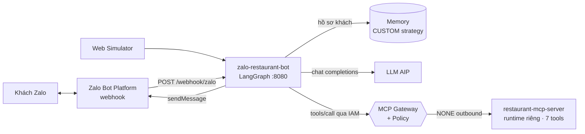

# 🍜 Zalo Restaurant Bot — "Quán Ngon 123" (khách-quen có hồ sơ)

> Sample **end-to-end** trên **GreenNode AgentBase**: Agent Runtime + **MCP server tùy chỉnh chạy như 1 runtime riêng** + **MCP Gateway** (IAM + Policy) + **Memory CUSTOM** (hồ sơ khách quen) + **Zalo Bot Platform** (webhook thật) + **Web Simulator**.

📚 [Sơ đồ kiến trúc tương tác](docs/architecture.html) · 🇻🇳 Tài liệu tiếng Việt

---

## ✨ Trải nghiệm chính — *quán nhớ khách*

| Tình huống | Bot làm gì (tự động) |
|---|---|
| "Tôi là Hùng, đặt bàn tối nay 4 người, **không ăn được cay**" | 📋 Check bàn qua **MCP** (`check_availability`) → đề xuất bàn • 🧠 `remember` "Hùng không ăn cay" • xác nhận + `create_booking` |
| Quay lại bằng **Zalo** (session mới): "Cuối tuần này tôi quay lại quán" | ✨ *"Dạ em nhớ anh Hùng rồi ạ! Lần trước anh ngồi bàn T3, **bếp luôn nêm nếm không cay** cho anh"* — hồ sơ khách từ **Memory CUSTOM strategy** |
| Người lạ gọi `/webhook/zalo` không có secret | 🔒 **403 Denied** (header `X-Bot-Api-Secret-Token`) |

**Web Simulator** (`GET /`): giao diện Zalo (khung điện thoại), nhập khách mới, chat, panel **🧠 Hồ sơ khách** + **📋 Đặt bàn hiện có** (đọc trực tiếp từ MCP server).

## 🏗 Kiến trúc — 2 runtime, 1 gateway



- **`src/mcp-server`** — MCP server FastMCP (stateless HTTP) với 7 tool nghiệp vụ quán: `get_menu`, `check_availability`, `create_booking`, `list_bookings`, `cancel_booking`, `get_loyalty`, `add_loyalty_points` — **deploy thành 1 runtime AgentBase riêng**, gateway trỏ tới qua connector `restaurant` (outbound **NONE**).
- **`src/backend`** — agent LangGraph + Memory (1 strategy **CUSTOM** "customer-profile") + webhook Zalo (verify secret, chống retry trùng, reply `parse_mode=markdown`).
- **Policy** — `sample-gw-policy`: zalo-bot chỉ được 7 action `restaurant__*`; travel-buddy (repo mẫu khác) chỉ được `tavily__*`; còn lại **deny mặc định**.

## 📁 Cấu trúc

```
├── src/mcp-server/       # main.py (FastMCP 7 tools) · Dockerfile · requirements.txt
├── src/backend/          # main.py · agent.py · memory_tools.py · zalo.py · mcp_client.py
├── src/frontend/         # simulator (index.html · style.css · app.js)
├── docs/architecture.html
├── Dockerfile · .env.example
```

## 🚀 Chạy local

```bash
# 1) MCP server (bắt buộc chạy trước — agent gọi nó)
cd src/mcp-server && docker build -t restaurant-mcp . && docker run -p 8081:8080 restaurant-mcp
# 2) Agent
cd ../.. && cp .env.example .env   # MCP_RESTAURANT_URL=http://host.docker.internal:8081/mcp
docker build -t zalo-bot . && docker run -p 8080:8080 --env-file .env zalo-bot
# mở http://localhost:8080 (simulator)
```

Không có Zalo token vẫn dùng được 100% qua **simulator**; `zalo_configured=false` sẽ hiện trên UI.

## ☁️ Deploy lên GreenNode AgentBase — qua Portal (UI)

Portal: **https://aiplatform.console.vngcloud.vn**. Bước 1 (LLM key) và Bước 3–4 (Gateway/Policy) giống repo [greennode-agentbase-sample-travel-buddy](../greennode-agentbase-sample-travel-buddy) — chỉ khác connector & policy action (`restaurant__*`). Các bước riêng của repo này:

### Bước A — Deploy MCP server thành runtime riêng
1. `docker build -t <registry>/zalo-mcp-server:v1 src/mcp-server/ && docker push …`
2. Portal → **Agents → Create Agent (Custom)**: name `zalo-mcp-server`, image trên, flavor `runtime-s2-general-2x4`, **không cần env**.
3. ACTIVE → copy **endpoint URL**. Test: mở `<endpoint>/health` phải trả `{"status":"ok","tools":7}`.

### Bước B — Thêm connector `restaurant` (No authorization)
Portal → Gateway `sample-mcp-gw` → **Add Custom Connector**:
- **Name**: `restaurant` · **Type**: `MCP`
- **Endpoint / Connect URL**: `<endpoint-mcp-server-bước-A>/mcp`
- **Outbound auth**: **No authorization** (server nội bộ, không secret)

API: `PATCH /gateway/api/v1/gateways/sample-mcp-gw {"targets":[…,{"name":"restaurant","type":"MCP","endpoint":"<url>/mcp","outboundAuth":{"type":"NONE"}}]}`.

### Bước C — Deploy agent runtime
1. `docker build -t <registry>/zalo-restaurant-bot:v1 . && docker push …`
2. Portal → **Create Agent (Custom)**: name `zalo-restaurant-bot`, env theo bảng bên dưới.
3. Mở endpoint → **Web Simulator** chạy ngay.

### Bước D — Nối Zalo Bot thật (bot.zaloplatforms.com)
1. Tạo bot: **https://bot.zaloplatforms.com** → *Tạo Bot* (docs: [create-bot](https://bot.zaloplatforms.com/docs/create-bot/)) → nhận **Bot Token** dạng `<id>:<secret>` (reset được trong Zalo Bot Creator).
2. Vào Portal AgentBase → agent `zalo-restaurant-bot` → **Update Environment**: thêm `ZALO_BOT_TOKEN` + `ZALO_WEBHOOK_SECRET` (chuỗi bí mật 8–256 ký tự bạn tự đặt) → runtime tự restart.
3. Đăng ký webhook (1 lệnh, docs [setWebhook](https://bot.zaloplatforms.com/docs/apis/setWebhook/)):
   ```bash
   curl -X POST "https://bot-api.zaloplatforms.com/bot${ZALO_BOT_TOKEN}/setWebhook" \
     -H "Content-Type: application/json" \
     -d '{"url":"<endpoint-runtime>/webhook/zalo","secret_token":"<ZALO_WEBHOOK_SECRET>"}'
   # ✓ "verification":{"ok":true,"outcome":"webhook.ok"}
   ```
4. **Nhắn tin cho bot trên app Zalo** (link chia sẻ bot trong Zalo Bot Creator) → bot trả lời + lưu hồ sơ khách. Xem lại cấu hình: `getWebhookInfo` · test: `testWebhook`.
5. Bot trả lời bằng `parse_mode=markdown` (bold/list hiển thị chuẩn trên Zalo). Chỉ xử lý `event_name = message.text.received`; image/sticker/voice được bỏ qua an toàn.

## 🔧 Env reference

| Biến | Bắt buộc | Ý nghĩa |
|---|---|---|
| `LLM_API_KEY` · `LLM_MODEL` | ✅ | LLM AIP |
| `AGENTBASE_MEMORY_ID` | ✅ | `memory-…` (tạo như Bước 2 repo travel, **1 strategy CUSTOM** tên `customer-profile`, prompt: *"Rút trích hồ sơ khách quán: tên, số điện thoại, sở thích ăn uống (chay/cay/…) dị ứng, bàn quen, ngày sinh nhật, lịch sử đến quán."*) |
| `MEMORY_STRATEGY_ID` | ✅ | `ltms-…` của strategy đó |
| `MCP_RESTAURANT_URL` | ✅ | `<gateway-url>/restaurant` |
| `ZALO_BOT_TOKEN` | tuỳ chọn | bật chế độ Zalo thật |
| `ZALO_WEBHOOK_SECRET` | khuyến nghị | verify header `X-Bot-Api-Secret-Token` |
| `ZALO_API_BASE` | mặc định | `https://bot-api.zaloplatforms.com` |

## 🔌 API contract

| Method | Path | Mô tả |
|---|---|---|
| POST | `/invocations` | simulator/REST chat (headers user/session) · `{"op":"whoami"}` |
| POST | `/webhook/zalo` | webhook Zalo Bot Platform (verify secret, dedupe `message_id`) |
| GET | `/webhook/zalo?challenge=` | kiểm tra thủ công |
| GET | `/api/memory?actor=` · `/api/history` · `/api/actors` | hồ sơ khách · hội thoại · khách đã có |
| GET | `/api/bookings` | gọi MCP `list_bookings` trực tiếp |
| GET | `/api/info` · `/health` | cấu hình (có `zalo_configured`, tên bot) |

## ✅ Đã verify E2E (tài khoản mẫu)

- MCP server runtime ACTIVE (`/health` → 7 tools) · connector `restaurant` qua gateway OK.
- Hùng (không cay) → bàn T3; Lan (ăn chay, 6 khách, T7) → đặt bàn thành công; quay lại session mới → bot nhớ đúng hồ sơ.
- Webhook: secret đúng → xử lý + reply (`sent` thực tế khi chat Zalo thật); secret sai → **403**; `setWebhook` trả `verification.ok = true`.
- Policy: token lạ gọi gateway → *"Request denied by policy."*

## 💰 Chi phí & dọn dẹp

- **2 runtime** real wallet (mcp-server + agent, mỗi cái 1 replica 2x4). Teardown: delete 2 runtime, connector `restaurant`, memory, LLM key — hoặc skill `agentbase-teardown`.

